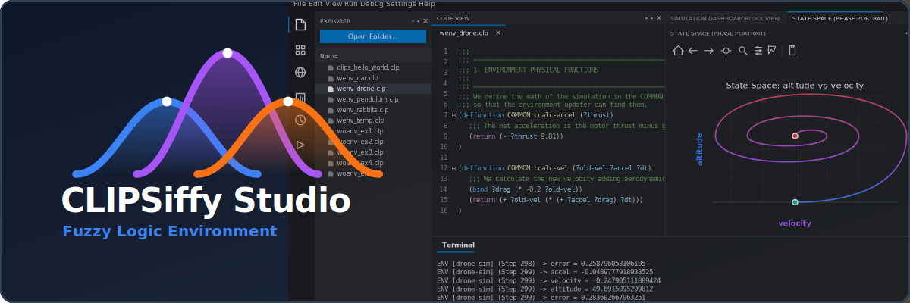

# CLIPSiffy Studio - Official Documentation

## Overview

This is a specialized Integrated Development Environment designed to build, debug, and visualize Expert Systems and Fuzzy Logic controllers.

Unlike standard text editors, this IDE is deeply integrated with the CLIPS environment and features native visual support for both Type-1 and Type-2 Fuzzy Logic. It bridges the gap between raw CLIPS syntax and modern visual engineering tools by providing real-time memory inspection, visual block diagrams, and mathematical inference rendering.

## Installation

To install this project as an executable, use the following command:

```bash
pyinstaller --onefile --name "CLIPSiffy Studio" --noconsole --icon="images/icon.ico" --exclude-module PySide6 --hidden-import cffi --hidden-import _cffi_backend --collect-all qtvscodestyle --add-data "docs_ide;docs_ide" --add-data "fuzzy_lib;fuzzy_lib" --add-data "images;images" main.py
```